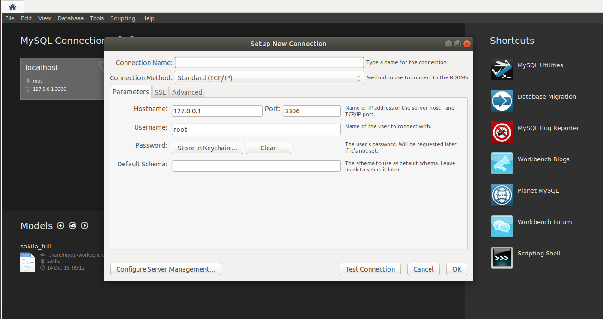

# Liberar relatório Free valorize

Aqui estará descrito os procedimentos para liberar qualquer relatório para um cliente do free valorize.

OBS: Eu não sei se esse é o jeito mais correto de realizar esse procedimento, mas por falta de conhecimento do produto foi a forma que encontrei de resolver.

## Prerequisitos

- Ter o **Mysql Workbench** instalado

- Email da pessoa que você deseja liberar o relatório
- Nome da empresa do relatório

## Procedimentos

Abra o Mysql Workbench, adicione uma nova conexão com as credenciais do banco do Free valorize que você deseja realizar a liberação do relatório.



---

Abra uma nova aba de script e digite:

```sql
  use freevalorize_prod;
```

Após isso será necessário encontrar o **usuário** dentro do banco que você deseja liberar o relatório. A melhor forma de fazer isso é sabendo o email dele cadastrado na plataforma.

Sabendo o email, execute:

```sql
  select * from users where email = <email_cliente>;
```

Assim você conseguira o **id** do usuário.

Aṕos, será necessário encontrar a empresa do relatório / **valuation**.

Para encontra-la iremos filtrar todas as valuations do usuário encontrado acima:

```sql
  select * from valuations where user_id = <id_usuário>;
```

O retorno será todas as valuations, então é so procurar a valuation que o usuário solicitou liberação e guardar seu **id** para realização dos próximos passos.

Agora, você terá que inserir dados de uma compra fake, para que o relatório seja emitido.

Execute o comando abaixo:

```sql
  insert into purchases (user_id, created_at, total, redirect_to)
  values (<id_usuário>, now(), 826.000, '/valuation/<id_valuation>/view');
```

Após inserir essa purshace, salve seu **id** para os próximos passos.

Agora é necessário criar uma transaction:

```sql
  insert into transactions (user_id, payment_confirmed_at, status, redirect_to)
  values (<id_usuário>, now(), 'confirmed', '/valuation/<id_valuation>/view');
```

Novamente recupere o **id** da transaction para uso futuro.

Após isso é necessário criar uma relação entre a compra e a transação.

```sql
  insert into purchase_transactions (purchase_id, transaction_id)
  values (<id_purchase>, <id_transaction>);
```

Por fim basta atualizar a valuation com o **id** da relação purchase criada anteriormente:

```sql
update valuations set active_purchase_id = <id_purchase> where id = <id_valuation>;
```

Pronto, relatório liberado :)
